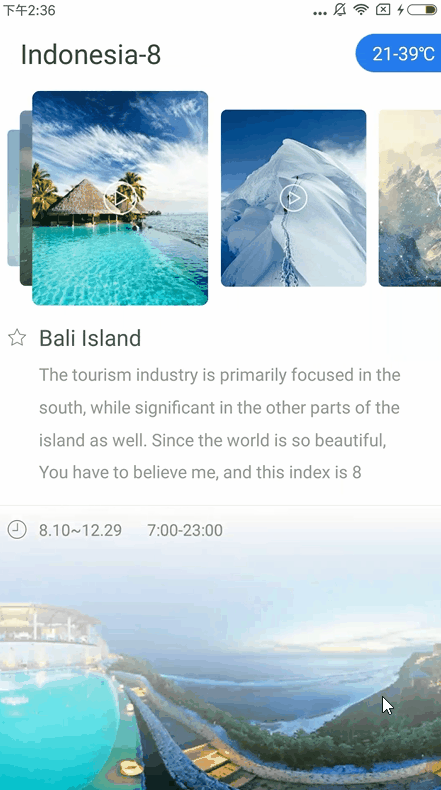

# android-pile-layout
An abnormal horizontal ListView-like pile layout.

### captured images
The following pictures were captured earlier. Since the source code and the outputted-apk have changed some params, you will have a different UI when you directly run the code or install the apk file. Hope there has no confusions later.  <br><br>
  

### design
Recently I have seen this kind of UI design, and at the first sight I was trying to implement it by using RecyclerView's LayoutManager. Unfortunately, I am unable to contrust a clear Math model while sliding the PileView. After several tries, I gave up LayoutManager, and find another way for this implementation. If you make LayoutManager works well for this UI design, please tell me later.

### how to use
1. declare PileLayout in your xml file
```xml
<com.stone.pile.libs.PileLayout
        android:id="@+id/pileLayout"
        android:layout_width="match_parent"
        android:layout_height="wrap_content"
        android:paddingBottom="5dp"
        android:paddingTop="5dp"
        pile:displayCount="1.5"
        pile:interval="10dp"
        pile:scaleStep="0.22"
        pile:widthHeightRate="1.22" />
```
Meanwhile, pileLayout is able to be customized by these 4 params:

|name|format|description|
|:---:|:---:|:---:|
| interval | dimension |items-margin each other
| sizeRatio | float |each item's height/witdth
| scaleStep | float |size scale step when needed
| displayCount | float |number of items that may display

2. in Java files:
```java
pileLayout = (PileLayout) findViewById(R.id.pileLayout);
pileLayout.setAdapter(new PileLayout.Adapter() {
            @Override
            public int getLayoutId() {
                // item's layout resource id
                return R.layout.item_layout;
            }

            @Override
            public void bindView(View view, int position) {
                ViewHolder viewHolder = (ViewHolder) view.getTag();
                if (viewHolder == null) {
                    viewHolder = new ViewHolder();
                    viewHolder.imageView = (ImageView) view.findViewById(R.id.imageView);
                    view.setTag(viewHolder);
                }
                // recycled view bind new position
            }

            @Override
            public int getItemCount() {
                // item count
                return dataList.size();
            }

            @Override
            public void displaying(int position) {
                // right displaying the left biggest itemView's position 
            }

            @Override
            public void onItemClick(View view, int position) {
                // on item click
            }
});
```

### demo apk
[download](capture/app-debug.apk)

## License

    Copyright 2017, xmuSistone

    Licensed under the Apache License, Version 2.0 (the "License");
    you may not use this file except in compliance with the License.
    You may obtain a copy of the License at

       http://www.apache.org/licenses/LICENSE-2.0

    Unless required by applicable law or agreed to in writing, software
    distributed under the License is distributed on an "AS IS" BASIS,
    WITHOUT WARRANTIES OR CONDITIONS OF ANY KIND, either express or implied.
    See the License for the specific language governing permissions and
    limitations under the License.
